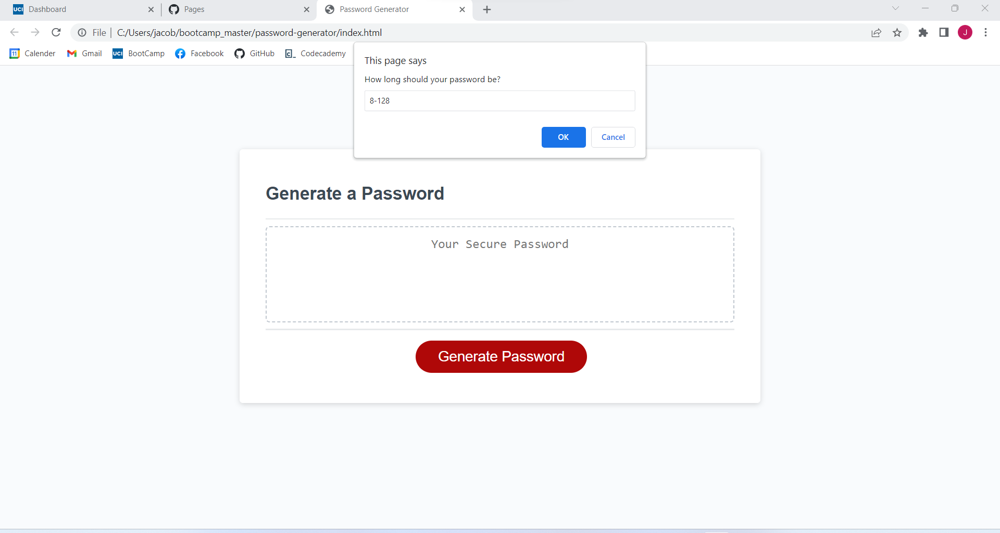

# Password Generator Starter Code
[Click to view page](https://searaden.github.io/password-generator/)

## Description
This project generates a unique password for the user based on choices the user makes using the prompt and alert commands. The password then is created and runs a loop to verify all conditions the user asked for are given. If any fail a new password is generated.

## Usage
The use clicks on the "Generate Password" button. A prompt will appear asking 
- how long the password should be (8-128), (system verifies a number between 8-128)
- should it contain lowercase (yes or no), (system verifies yes or no)
- should it contain uppercase (yes or no), (system verifies yes or no)
- should it contain numbers (yes or no), (system verifies yes or no)
- should it contain special characters (yes or no), (system verifies yes or no)

The program verifies that a correct and usable value is given for all these. It will check atlease one of the yes or no questions is answered yes otherwise it will restart because nothing would be generated. At the end a for loop is run to verify the password meets all criteria.

## Sources
https://chat.openai.com/ - Used to verify code and learned how to use the math functions along with mathFloor. Also used to help make the loop to verify all content existsgit 
https://stackoverflow.com/questions/67830175/how-to-ignore-case-when-dealing-with-a-variable-in-an-if-statement-javascript - use to ignore case and use the .lowerCase